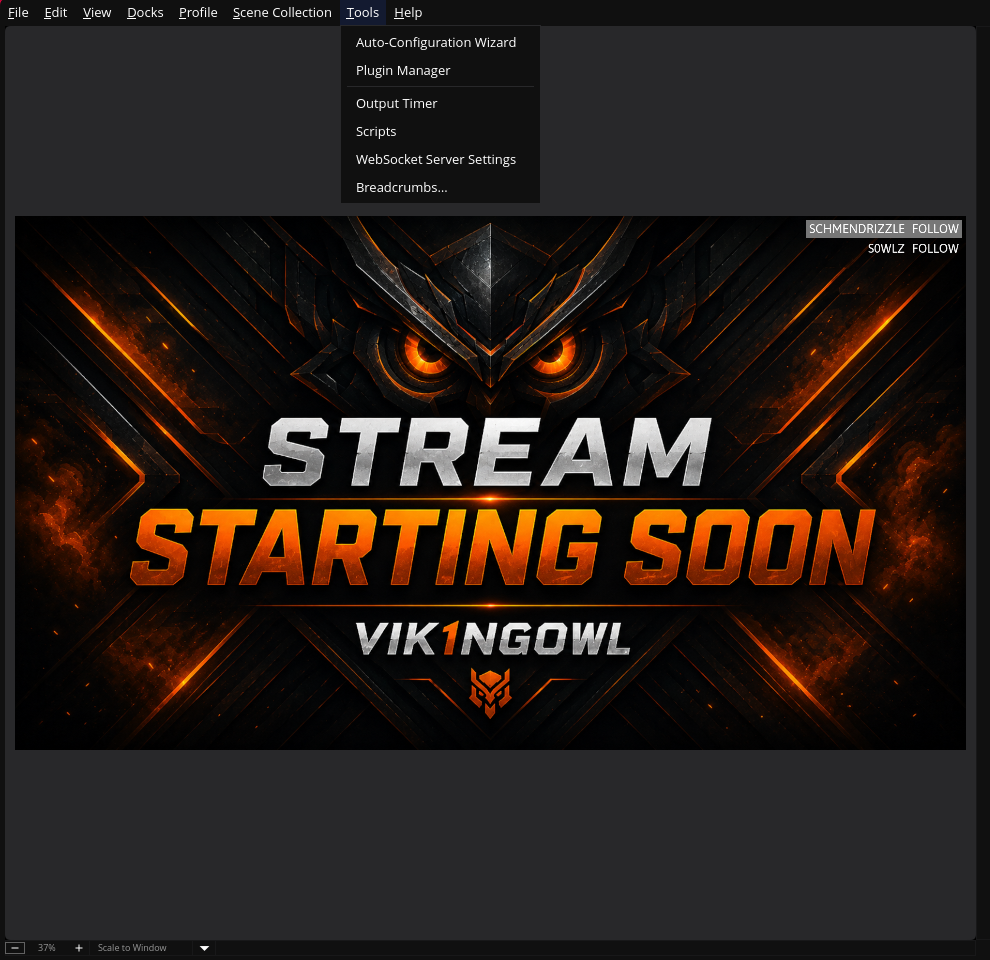
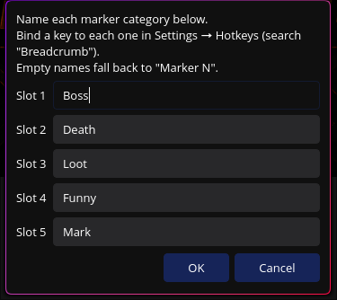
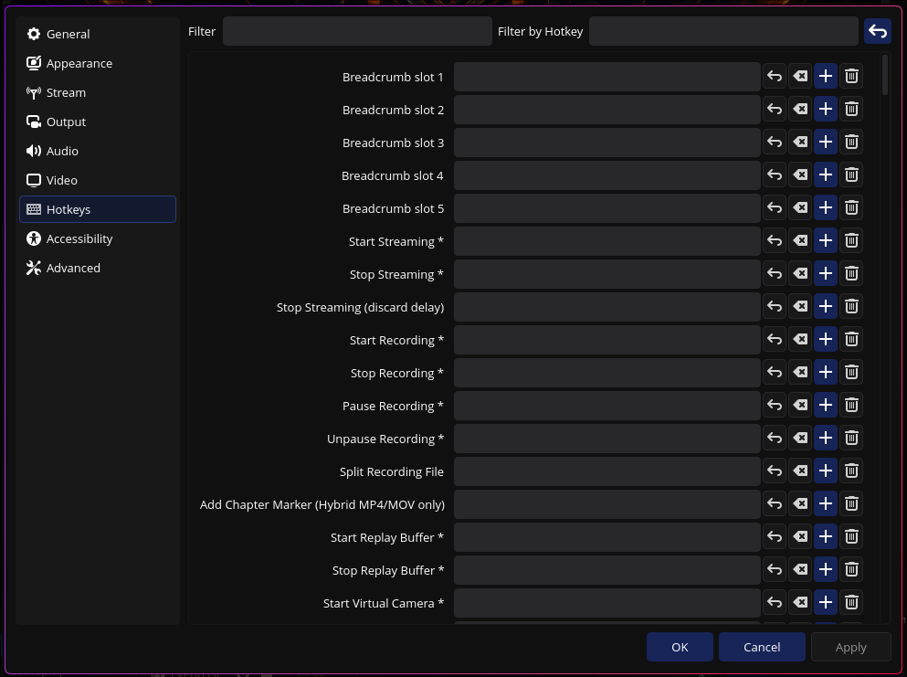

# Breadcrumbs for OBS

Drop timestamped markers into your recording with a hotkey, so you can find the
moments that matter when you edit later — instead of scrubbing through hours of
footage.

Built for long, unbroken recordings (game runs, streams). Markers are written to
a plain-text sidecar file next to the recording, which means it works with
**any container — including MKV** (OBS's built-in chapter markers only support
MP4/MOV).

## How it works

Define up to **5 marker categories** in **Tools → Breadcrumbs…**:





Then bind a key to each category in **Settings → Hotkeys** (search for
*"Breadcrumb"* — the five slots appear at the top of the list):



While recording, press a category's hotkey to append a line to a `.txt` file
next to the recording:

```
00:12:43 - Boss
00:41:09 - Death
01:58:21 - Funny
```

- The timestamp is the **position inside the video file** (frames ÷ FPS), so it
  stays correct across pauses and lands exactly where your editor's playhead
  goes when you scrub to it.
- The sidecar shares the recording's name: `2026-06-25_run.mkv` →
  `2026-06-25_run.txt`.
- Empty category names fall back to `Marker N`.

## Installation

Download the package for your OS from the
[latest release](https://github.com/VikingOwl91/obs-breadcrumbs/releases/latest),
then follow the steps below. After installing, **fully restart OBS** (plugins
load only at startup).

> The macOS package and Windows binaries are **not code-signed**, so your OS may
> warn about an unidentified developer the first time. That's expected for a
> self-built plugin — see the per-OS notes below.

### Windows

**From the release package:** extract the downloaded archive and copy its
contents into your OBS install folder so the files land here:

```
C:\Program Files\obs-studio\obs-plugins\64bit\obs-breadcrumbs.dll
C:\Program Files\obs-studio\data\obs-plugins\obs-breadcrumbs\locale\en-US.ini
```

**Per-user (no admin rights) alternative:**

```
%APPDATA%\obs-studio\plugins\obs-breadcrumbs\bin\64bit\obs-breadcrumbs.dll
%APPDATA%\obs-studio\plugins\obs-breadcrumbs\data\locale\en-US.ini
```

If Windows SmartScreen blocks the file, right-click the `.dll` → **Properties** →
tick **Unblock**.

### macOS

Open the downloaded `.pkg` and follow the installer. Because it isn't notarized,
Gatekeeper will likely refuse it on first launch — **right-click the `.pkg` →
Open**, then confirm, or allow it under **System Settings → Privacy & Security**.

The plugin installs to:

```
~/Library/Application Support/obs-studio/plugins/obs-breadcrumbs.plugin
```

### Linux

**Ubuntu / Debian:** install the `.deb` from the release:

```bash
sudo apt install ./obs-breadcrumbs-*-x86_64-linux-gnu.deb
```

**Any distro (per-user, no root):** unpack the binary and data into your OBS
config so they land here:

```
~/.config/obs-studio/plugins/obs-breadcrumbs/bin/64bit/obs-breadcrumbs.so
~/.config/obs-studio/plugins/obs-breadcrumbs/data/locale/en-US.ini
```

> **Flatpak OBS** is sandboxed and won't see plugins installed this way; install
> the plugin as a Flatpak extension or use a native OBS package instead.

### Verifying it loaded

Launch OBS from a terminal and look for:

```
[obs-breadcrumbs] plugin loaded successfully (version 1.0.0)
```

(Logs are also written to OBS's log folder, viewable via **Help → Log Files**.)
Then check that **Tools → Breadcrumbs…** and the **Breadcrumb** hotkeys exist.

## Hotkeys on Linux/Wayland

On **Windows and macOS**, the **Settings → Hotkeys** bindings are true global
hotkeys — they fire even when OBS is in the background, nothing extra to do.
(macOS will ask you to grant OBS *Accessibility / Input Monitoring* permission
the first time — that's required for any OBS background hotkey.)

**Wayland is different:** the compositor refuses to deliver key presses to an
app that isn't focused, so OBS's own hotkeys — and therefore the *Settings →
Hotkeys* bindings — **won't fire while OBS is hidden**. This affects every OBS
hotkey, not just Breadcrumbs.

To work around it, Breadcrumbs registers its five slots as **global shortcuts
via the `org.freedesktop.portal.GlobalShortcuts` desktop portal** when OBS
starts on Wayland. Your compositor then routes the keys, even when OBS is in the
background. You bind the actual keys **in your compositor**, not in OBS:

### Hyprland

1. Start OBS once (so the shortcuts register), then list them:

   ```bash
   hyprctl globalshortcuts
   ```

   You'll see entries like (the `appid` prefix depends on your portal):

   ```
   com.obsproject.Studio:breadcrumbs-slot1 -> Breadcrumb slot 1 (Boss)
   com.obsproject.Studio:breadcrumbs-slot2 -> Breadcrumb slot 2 (Death)
   ...
   ```

   The `com.obsproject.Studio` prefix is the app id Breadcrumbs registers with
   the portal (OBS itself registers no global shortcuts, so the
   `breadcrumbs-slotN` names are unambiguously ours).

2. Bind keys to those names with the `global` dispatcher in `hyprland.conf`,
   using the exact name from step 1:

   ```ini
   bind = $mainMod, F7,  global, com.obsproject.Studio:breadcrumbs-slot1
   bind = $mainMod, F8,  global, com.obsproject.Studio:breadcrumbs-slot2
   bind = $mainMod, F9,  global, com.obsproject.Studio:breadcrumbs-slot3
   bind = $mainMod, F10, global, com.obsproject.Studio:breadcrumbs-slot4
   bind = $mainMod, F11, global, com.obsproject.Studio:breadcrumbs-slot5
   ```

   Reload (`hyprctl reload`) and the keys work regardless of OBS focus.

### KDE Plasma / GNOME

These expose portal global shortcuts in their settings UI: find the
**Breadcrumb slot N** entries under **System Settings → Shortcuts** (KDE) or
**Settings → Keyboard → Keyboard Shortcuts** (GNOME 48+) and assign a key to
each.

> The portal shortcut descriptions include your category names, captured when
> OBS starts — if you rename categories, restart OBS so the updated labels show
> up in `hyprctl globalshortcuts` / your shortcut settings.
>
> The X11 session is unaffected: there OBS's normal global hotkeys work and the
> portal isn't used.

### Notes & troubleshooting

- The shortcuts are registered a few seconds **after** OBS finishes loading
  (not during startup). This is deliberate: issuing the registration mid-startup
  can intermittently upset some desktop portals (notably
  `xdg-desktop-portal-hyprland`) and briefly hang OBS's own **Settings** dialog.
  So expect the `breadcrumbs-slotN` entries to appear in
  `hyprctl globalshortcuts` a moment after launch.
- If global shortcuts ever cause trouble, set the environment variable
  **`OBS_BREADCRUMBS_NO_PORTAL=1`** before launching OBS to skip portal
  registration entirely (hotkeys then work only while OBS is focused, like any
  normal OBS hotkey on Wayland).

## Building from source

The project uses the standard OBS plugin build system (CMake + the official
template's GitHub Actions CI), producing artifacts for Windows, macOS, and
Linux.

### Local (Linux, against installed libobs)

```bash
cmake -S . -B build -G Ninja -DCMAKE_BUILD_TYPE=RelWithDebInfo \
  -DENABLE_FRONTEND_API=ON -DENABLE_QT=ON
cmake --build build
```

### Windows / macOS / packaged builds

Use the bundled CMake presets (they download the matching OBS + Qt deps listed
in `buildspec.json`), or just push to GitHub and let the CI in
`.github/workflows` build and package all three platforms. Pushing a semver tag
(e.g. `1.0.0`) creates a draft release with the packages attached.

## License

GPL-2.0-or-later. See [LICENSE](LICENSE).
